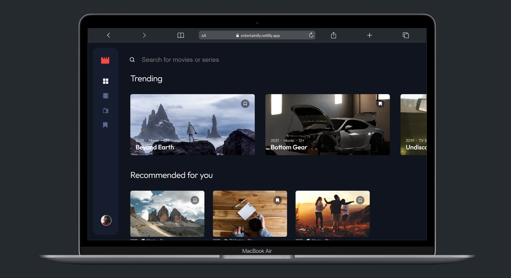

# Frontend Mentor - Entertainment web app

This is a solution to the [Entertainment web app challenge on Frontend Mentor](https://www.frontendmentor.io/challenges/entertainment-web-app-J-UhgAW1X). Frontend Mentor challenges help you improve your coding skills by building realistic project.

## Table of contents

- [Overview](#overview)
  - [The challenge](#the-challenge)
  - [Screenshot](#screenshot)
- [My process](#my-process)
  - [Built with](#built-with)
  - [What I learned](#what-i-learned)
- [Author](#author)
- [Acknowledgments](#acknowledgments)

**Note: Delete this note and update the table of contents based on what sections you keep.**

## Overview

### The challenge

Users should be able to:

- Register or login on the initial screen
- View the optimal layout for the app depending on their device's screen size
- See hover states for all interactive elements on the page
- Navigate between Home, Movies, TV Series, and Bookmarked Shows pages
- Add/Remove bookmarks from all movies and TV series
- Search for relevant shows on all pages

### Screenshot

### Live Site

- Live Site URL: [https://entertainify.netlify.app/](https://entertainify.netlify.app/)

  Feel free to log in with the following data...

  email: demo-user@mail.com
  password: Start123

  ...or feel free to try out the signup functionality yourself.

## My process

I was provided with the figma files by Frontendmentor.

### Built with

- React via Vite
- TypeScript
- Styled Components
- Firebase REST API

In this project I am leveraging the recent update of React Router Dom by using its createBrowserRouter API in conjunction with loaders and actions which reduces the usecases of useEffect.

### What I learned

During this project I learned a lot about authentication in generel. Since this is a dummy app which is supposed to demonstrate my skills in frontend web development I kept things simple and didn't implement a heavy backend solution but rather used the firebase REST API solution. I studied a lot of resource regarding security, how to save the token safely. In my case, I needed an easy solution to access the JWT Token on the client side since my Route Protection is checking the localStorage, if a token is existing there. For the future, I am super curious about other, more safe and industry standard solutions to this.

## Author

- Julian Köhler - [@JulianKoehler](https://www.frontendmentor.io/profile/JulianKoehler)

## Acknowledgments

Credits for Frontendmentor for this clean design. When it comes to code, I implemented everthing from scratch up.
